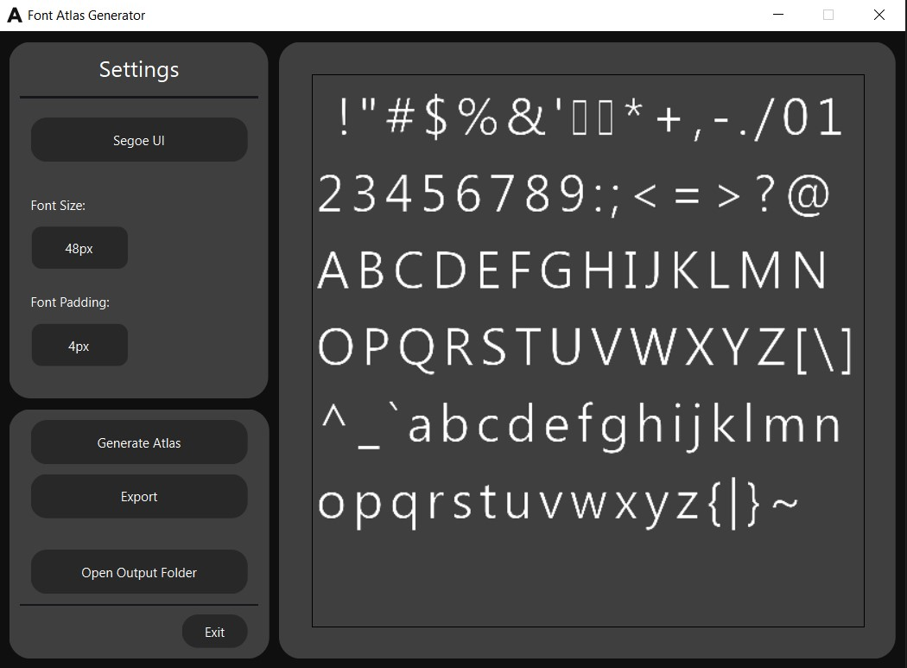

# Font Atlas Generator

This tool processes a font (.ttf & .otf) into an atlas texture of the full ASCII charset, along with the coordinates of each character.

Created to assist in modding/creating RBRHUD Overlays or RBRHUD Gauges.

[Download](https://github.com/kurokurome/font-atlas-generator/releases)

---

When the program starts for the first time, two folders will be created:

- `fonts`: To help manage fonts that will be used.
- `outputs`: Where the atlas and coordinates file will be saved after exporting.

## Font Settings

- Allowed Font size: 24-50px
- Allowed Font Padding size (for each character): 1-10px

---

## HOW TO USE THE GENERATOR

- Put font files that you want to use inside `fonts` folder
- Select the file in the program
- Set the font size and font padding size
- Click "Generate Atlas" and it will show you a preview of the atlas
- Click "Export". The atlas and the coordinate file will be saved inside `outputs` folder

#### Tips: If you want to you fonts that is installed in your computer, you can find it in `C:\Windows\Fonts`. Copy the fonts and paste it inside `fonts` folder that the program created.

---

## Preview

---

### Credit to Towerbrah for the original idea of atlas generator

**PS I'm a beginner in programming. Expect some bug/error and unoptimize code. :)**
